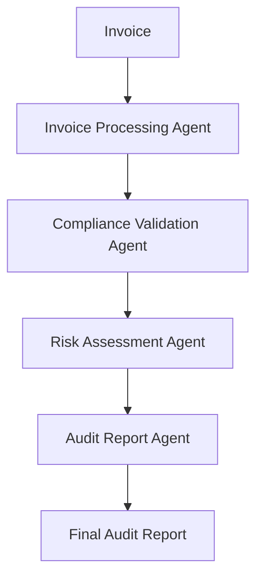

# 🛡️ Procurement Auditor AI

AI-powered multi-agent procurement auditing system that automatically validates invoices, detects pricing anomalies, identifies compliance violations, and generates audit reports.

Built using CrewAI, OpenAI GPT-4o, and Python.


## Executive Summary

Procurement fraud and invoice errors cost organizations millions annually.

This project uses a collaborative AI agent system to automate procurement auditing by:

- Extracting information from invoices
- Validating contract compliance
- Detecting pricing discrepancies
- Assessing procurement risk
- Generating audit-ready reports

The system reduces manual review time from hours to seconds while improving audit consistency.

## System Architecture

Invoice
   ↓
Invoice Agent
   ↓
Compliance Agent
   ↓
Risk Assessment Agent
   ↓
Audit Report Agent

Final Audit Report




## Key Features

✅ Invoice Data Extraction

✅ Contract Compliance Verification

✅ Pricing Anomaly Detection

✅ Risk Scoring

✅ Procurement Fraud Detection

✅ Automated Audit Report Generation

✅ Multi-Agent Collaboration

✅ Human-Readable Audit Summaries
## Business Impact

Organizations can use this solution to:

- Reduce audit processing time
- Improve compliance monitoring
- Detect overbilling
- Reduce procurement fraud
- Improve supplier accountability
- Generate audit-ready documentation automatically
  
Agent
Role
Responsibility
Invoice Processor
Data Extraction
Extract invoice information
Compliance Validator
Policy Checker
Validate contracts and procurement policies
Risk Assessor
Risk Analysis
Detect anomalies and assign risk scores
Audit Reporter
Report Generation
Create executive audit reports

## Sample Audit Result

```json
{
  "invoice_id": "INV-2025-041",
  "vendor": "SupplyCo Ltd",
  "amount": "$125,000",
  "risk_score": 85,
  "risk_level": "HIGH",
  "finding": "Potential overcharging detected",
  "recommendation": "Reject invoice pending review"
}
```

Technology Stack

Category
Technology
Framework
CrewAI
LLM
GPT-4o
Language
Python 3.10
Deployment
CrewAI AMP
Data Processing
Pandas
API
FastAPI
Version Control
GitHub

## Why I Built This

I built Procurement Auditor AI to explore how multi-agent systems can automate procurement governance and compliance workflows.

The project demonstrates:

- Agent orchestration
- LLM reasoning
- Business process automation
- Compliance auditing
- Enterprise AI applications


